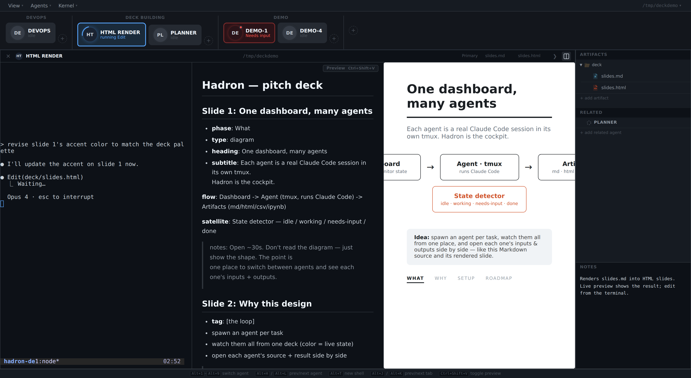

<p align="center">
  
</p>
<h1 align="center">Hadron</h1>
<p align="center"><em>Parallel Claude Code agents, one dashboard.</em></p>

<p align="center">
  
</p>

A web-based workspace for managing multiple AI coding agents in parallel. If you run several Claude Code (or similar) agents at once, Hadron gives you a single dashboard to see what they're all doing — each with its own terminal, file artifacts, notes, and automatic state tracking.

## Why Hadron?

Running multiple AI agents across different projects gets chaotic fast. You end up with a dozen terminal tabs, no idea which agent is thinking vs. blocked vs. done, and no way to see their output files side by side.

Hadron solves this by giving each agent a card on a shared deck. At a glance you can see: who's working, who's stuck waiting for input, who just finished, and what files they've produced. Click any card to jump into its full terminal — it's a real tmux session, not a sandbox.

## Key Features

- **Multi-agent dashboard** — See all agents at a glance, organized into groups. Automatic state detection shows who's working, idle, blocked, or done. (Detection is heuristic — it pattern-matches Claude Code's terminal output, so it may need tweaks as the CLI's UI evolves.)
- **Real terminals** — Each agent runs in its own tmux session, rendered via xterm.js. Full terminal emulation, not a log viewer.
- **Artifact panel** — Attach files to any agent: Markdown (rendered), Python (syntax-highlighted, editable via vim), CSV (table view), SQL, Jupyter notebooks, and Marimo notebooks.
- **Live artifacts** — File artifacts auto-reload when changed on disk (3s polling). Marimo notebooks support `--watch` for live editing. Switch agents without losing notebook state (iframe persistence).
- **Kernel config** — Configure which Python environment runs marimo/Jupyter per workspace. Use the `/hadron-notebook-kernel` skill to detect, create, or switch environments.
- **Notifications** — Sound + banner alerts when agents change state. Configurable: sound+banner, banner only, or off (View > Notifications).
- **Agent lifecycle** — Create, archive, restore, and permanently delete agents from the menu. Agents persist as JSON files — no database needed.
- **Groups & organization** — Organize agents into named groups (e.g., "DevOps", "Workers"). Drag to reorder. Lock groups to prevent ad-hoc additions.
- **Shell tabs** — Each agent can have multiple shell tabs (Alt+T) for parallel terminal work within one agent.
- **Keyboard-driven** — Switch agents (Alt+1-9), navigate (Alt+H/L), manage tabs (Alt+J/K), reload artifacts (Ctrl+Shift+R).
- **Theme system** — Default dark theme + Age of Exploration (大航海時代) theme with pixel art crew sprites and RPG-style status dialogs.
- **Remote-friendly** — Works great over SSH tunnels. Run on a cloud server, tunnel port 3000, use from anywhere.

## Quick Start

Hadron is AI-native: the only thing you install by hand is [Claude Code](https://claude.com/claude-code). It sets up the rest.

```bash
git clone <repo-url> hadron && cd hadron
claude            # then type:  /hadron-setup
```

The `/hadron-setup` skill checks your prerequisites, installs anything missing for your OS, scaffolds a workspace, starts the server, and opens the dashboard with a sample agent card ready to start.

**Mental model:** one server process watches one *workspace* directory (where `.hadron/` config lives). Each *agent* is a named tmux session with its own terminal, attached files (*artifacts*), and notes. The browser dashboard and the `hadron` CLI both talk to the server's HTTP API — the CLI is just a thin, authenticated client you (or an agent) can script.

**Manual install** (if you'd rather not let the agent run package managers):

```bash
# macOS:        brew install node tmux
# Debian/Ubuntu: sudo apt-get install -y nodejs npm tmux
npm install
npm run setup:check                      # verify node>=18, tmux>=3, port free
node scripts/setup-workspace.js ~/work   # scaffold workspace config + sample agent
node server/index.js ~/work              # start server, then open http://localhost:3000
```

## Requirements

- **Node.js** >= 18
- **tmux** >= 3.0
- macOS or Linux (uses `node-pty` for terminal emulation)
- **Claude Code** (recommended for setup and as the AI agent running inside Hadron)

### Optional

- **vim** for text file editing (Ctrl+Shift+V / Cmd+Shift+V)
- **Python 3** + **Jupyter** for live notebook editing
- **Marimo** for reactive notebook rendering
- **uv** for fast Python environment creation (used by `/hadron-notebook-kernel` skill)

## How It Works

### Workspace

The server takes a workspace directory as its argument (defaults to `process.cwd()`). All configuration lives in `<workspace>/.hadron/`:

```
~/work/.hadron/
  config.json       # Workspace name, group order, group attributes, kernel config
  agents/
    agent-name.json  # Per-agent config: group, artifacts, state, notes
```

Each agent gets a tmux session named `hadron-<workspace>-<agent-id>`. Shell tabs are sub-sessions named `hadron-<workspace>-<agent-id>-sh<N>`.

You can also set the workspace via environment variable:

```bash
HADRON_WORKSPACE=~/work node server/index.js
```

Priority: CLI argument > `HADRON_WORKSPACE` > `process.cwd()`

### State Detection

Hadron automatically detects what each agent is doing by polling its tmux pane:

| State | How it's detected |
|---|---|
| **idle** | Shell prompt (`❯`) visible, no activity |
| **working** | Claude process running + thinking/streaming indicators, tool execution, background agents |
| **blocked** | Permission dialog waiting for input, API errors (429, overloaded) |
| **done** | Claude process exited after a working session |

State detection resolves the actual tmux pane ID at startup (handles `base-index=1`), filters autocomplete suggestions, and ignores non-blocking surveys. Process-level signals are used as a fallback when terminal output formats change.

### Live Artifacts

File-based artifacts (`.py`, `.sql`, `.md`, `.csv`, etc.) are monitored for changes via mtime polling. When a file is modified on disk — by another agent, vim, or any editor — the artifact view auto-reloads within 3 seconds.

Marimo notebooks run with `--watch`, so cell edits on disk are picked up by the running marimo server automatically.

Iframe-based artifacts (live marimo/Jupyter) persist their state when you switch between agents — they're moved to an offscreen pool instead of being destroyed.

### Kernel Config

Hadron uses a per-workspace Python environment for launching marimo and Jupyter. Configuration lives in `.hadron/config.json`:

```json
{
  "kernels": {
    "marimo": "/home/user/work/.venv",
    "jupyter": "/home/user/work/.venv"
  }
}
```

Use the `/hadron-notebook-kernel` Claude Code skill to detect available environments, create new ones (via `uv` or `python3 -m venv`), and update the config. The **Kernel** menu in the menubar shows the current environment at a glance.

## Configuration Guide

### Workspace Config (`<workspace>/.hadron/config.json`)

This file controls the workspace name, group ordering, group-level attributes, and kernel config.

```json
{
  "name": "work",
  "groups": ["DevOps", "Workers", "Backup"],
  "groupConfig": {
    "DevOps": { "expandable": false }
  },
  "kernels": {
    "marimo": "/home/user/work/.venv"
  }
}
```

| Field | Type | Description |
|---|---|---|
| `name` | string | Display name shown in the top bar |
| `groups` | string[] | Ordered list of group names. Controls left-to-right display order in the deck. |
| `groupConfig` | object | Per-group attribute overrides (see below) |
| `kernels` | object | Python environment paths for notebook runtimes (see Kernel Config above) |

**Group attributes** (set inside `groupConfig.<GroupName>`):

| Attribute | Default | Description |
|---|---|---|
| `expandable` | `true` | When `false`, the "+" button is hidden and no new agents can be added to this group via the UI. |

### Agent Config (`<workspace>/.hadron/agents/<id>.json`)

Each agent is a JSON file. Agents are created from the UI (Agents > New Agent, or the "+" button in a group), but you can also create them manually:

```json
{
  "id": "homelab",
  "name": "homelab",
  "group": "DevOps",
  "state": "idle",
  "artifacts": [
    { "label": "README", "type": "file", "value": "homelab/README.md" }
  ],
  "notes": "",
  "deletable": false
}
```

| Field | Type | Description |
|---|---|---|
| `id` | string | Unique identifier. Also used as the tmux session name (`hadron-<id>`). |
| `name` | string | Display name (shown in deck and work header). |
| `group` | string | Which group this agent belongs to. Must match a name in `config.json`'s `groups` array. |
| `state` | string | Current state: `idle`, `working`, `blocked`, or `done`. Automatically detected. |
| `artifacts` | array | List of files shown in the context panel. Each has `label`, `type` (`file`), and `value` (file path). |
| `notes` | string | Free-text notes for this agent. |
| `deletable` | boolean | Default `true`. Set to `false` to prevent archiving/deletion. |
| `cwd` | string | Working directory for this agent's terminal. Defaults to workspace root. |
| `archived` | boolean | When `true`, agent is hidden from the deck. Restorable from Agents > Restore Agent. |

### Artifacts

Artifacts are files linked to an agent, displayed in the right-side context panel. Hadron renders them based on file extension:

| Extension | Renderer |
|---|---|
| `.md`, `.markdown` | Markdown preview (toggle raw/preview with Cmd+Shift+V) |
| `.py` | Syntax-highlighted Python; editable via vim |
| `.py` (marimo) | Marimo reactive notebook (live editor with `--watch`) |
| `.csv` | Table view with headers |
| `.sql` | Syntax-highlighted SQL |
| `.ipynb` | Jupyter notebook viewer (cells + outputs, live editor) |
| `.html` | Rendered in sandboxed iframe |
| Other | Vim editor with syntax highlighting |

Artifact paths can be **absolute** (`/home/user/work/file.md`), home-relative (`~/work/file.md`), or **relative to the workspace root** (`project/file.md`). Relative paths are recommended for portability.

### Sample Agent with All Artifact Types

The repo includes sample files in `examples/` demonstrating supported artifact types:

- `examples/demo.md` — Markdown with headers, code blocks, lists
- `examples/demo.py` — Python script with syntax highlighting
- `examples/demo.csv` — CSV table rendered as a grid
- `examples/demo.sql` — SQL query with syntax highlighting
- `examples/demo.ipynb` — Jupyter notebook with cells and outputs
- `examples/demo_notebook.py` — Marimo reactive notebook with charts

### Multiple Projects

Run separate Hadron instances on different ports:

```bash
node server/index.js ~/work/ato &                # port 3000
PORT=3001 node server/index.js ~/work &           # port 3001
```

Each instance shows its workspace name in the browser tab title. Tmux sessions are namespaced per workspace, so they don't collide.

## Keyboard Shortcuts

| Shortcut | Action |
|---|---|
| Alt+1-9 (Option+1-9) | Switch to agent by position |
| Alt+H / Alt+L | Previous / next agent |
| Alt+T | New shell tab |
| Alt+J / Alt+K | Previous / next shell tab |
| Cmd+Shift+V | Toggle markdown preview |
| Ctrl+Shift+R | Reload current artifact |

## Claude Code Skills

Hadron includes Claude Code skills that agents can invoke:

| Skill | Description |
|---|---|
| `/hadron-setup` | First-run setup — verify prerequisites, scaffold a workspace, start the server |
| `/hadron-whoami` | Detect agent identity, load config, understand role in the workspace |
| `/hadron-spawn` | Turn intent into a briefed, auto-started agent |
| `/hadron-artifacts` | Attach output files to this agent so they show in the dashboard |
| `/hadron-notebook-kernel` | Configure Python environment for marimo/Jupyter (detect, create, switch envs) |

## Deploying Remotely

The server binds `127.0.0.1` by default, so the simplest remote setup is an SSH tunnel — no need to expose the port:

```bash
# On the remote server
cd /path/to/hadron
npm install
node server/index.js ~/work &

# From your local machine — forwards your localhost:3000 to the server's
ssh -L 3000:localhost:3000 user@server
open http://localhost:3000
```

To reach it directly over Tailscale/LAN instead of a tunnel, bind to all interfaces with `HADRON_HOST`:

```bash
HADRON_HOST=0.0.0.0 node server/index.js ~/work &
open http://<tailscale-ip>:3000
```

The auto-generated token (`.hadron/token`) still gates every mutating request, but only expose the port on a trusted network (e.g. Tailscale), never the public internet.

## Roadmap

See [ROADMAP.md](ROADMAP.md) for the full roadmap. Current version: **v0.6**.

## Architecture

```
server/
  index.js          # Express + WebSocket server, tmux management, marimo/jupyter proxy
  state-detector.js # Automatic agent state detection from tmux pane content
  agent-store.js    # Agent persistence (JSON files)
client/
  index.html        # Single page app shell
  app.js            # All frontend logic (vanilla JS, no framework)
  style.css         # Dark theme styles
scripts/
  setup-workspace.js # Interactive workspace initializer
```

### Design Decisions

- **Vanilla JS** — no React/Vue/build step. Single `app.js` file.
- **tmux backend** — agents run in tmux sessions, terminals rendered via xterm.js over WebSocket.
- **File-based persistence** — agent state is JSON files, no database needed.
- **Dark theme** — GitHub-dark palette (`#0d1117` background).
- **Skills over UI** — complex config (kernels, onboarding) is handled by Claude Code skills, keeping the UI simple.

## Acknowledgements

Hadron began from [claude-squad](https://github.com/smtg-ai/claude-squad) (MIT) and was rebuilt as a web app. Thanks to that project and its contributors for the original inspiration.

## License

[MIT](LICENSE) © Yuda Zhao
